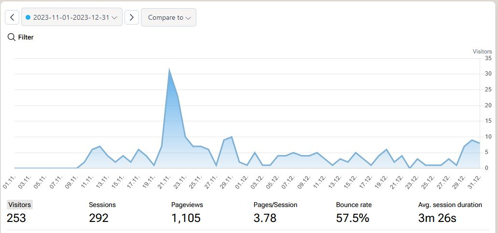

I wanted to do a quick 2023 wrap up covering the progress of Stitchtrove.

### Analytics

In November 2023 I finally decided on a privacy friendly analytics software, LiteAnalytics. 

A quick look at the last two months of Stitchtrove analytics (Nov + Dec 2023) show a spike from a Reddit comment I left, didn't even included a link, people were actively googling it based on the comment.

I'd like to try and improve the bounce rate to get it between 45-50% in 2024. I think a good start here would be to redesign the homepage so it's clear what the site actually does. Right now, its a mash and very plain. 

### Keywords

The site also landed some new keywords in December 2023 including:

- lola crow cross stitch               [18]
- lord libidan                         [18]
- cross stitch video games             [50]
- world of warcraft cross stitch       [29]
- funny cross stitch patterns free     [48]
- free sarcastic cross stitch patterns [33]
- cross stitch qr code                 [35]
- gamer cross stitch patterns          [15]

