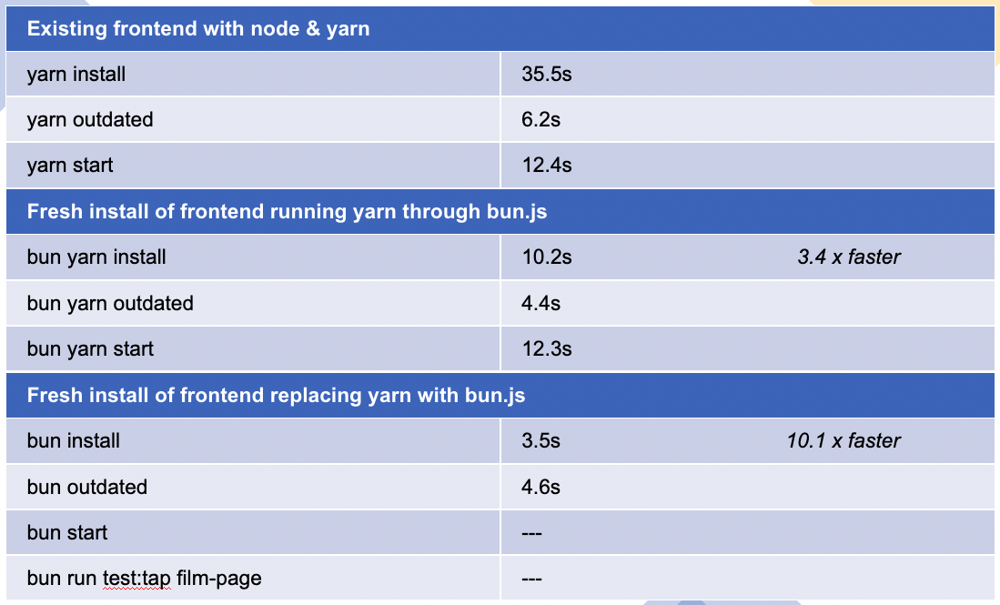
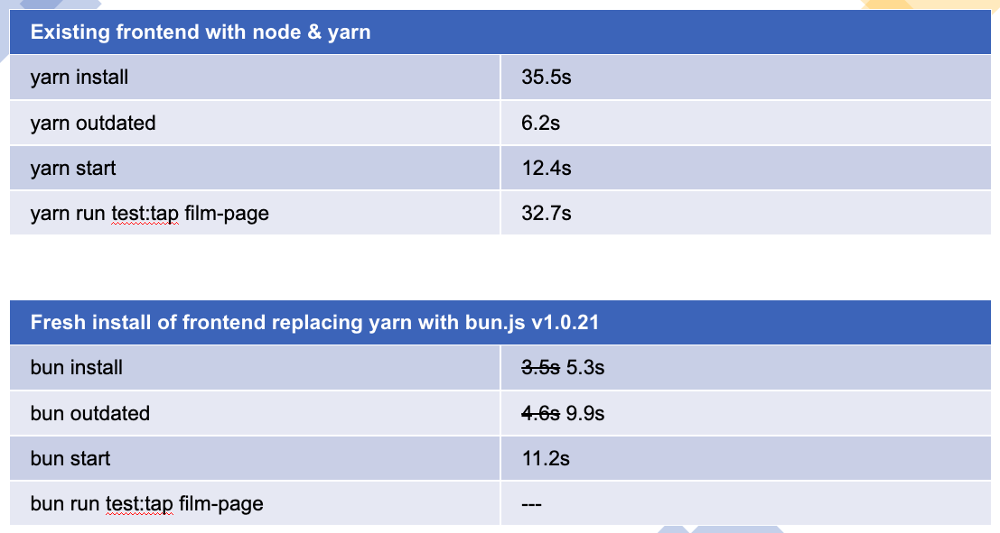
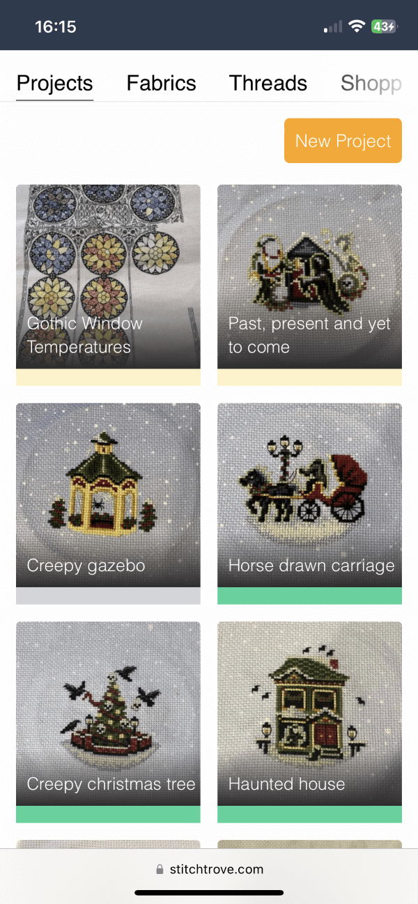
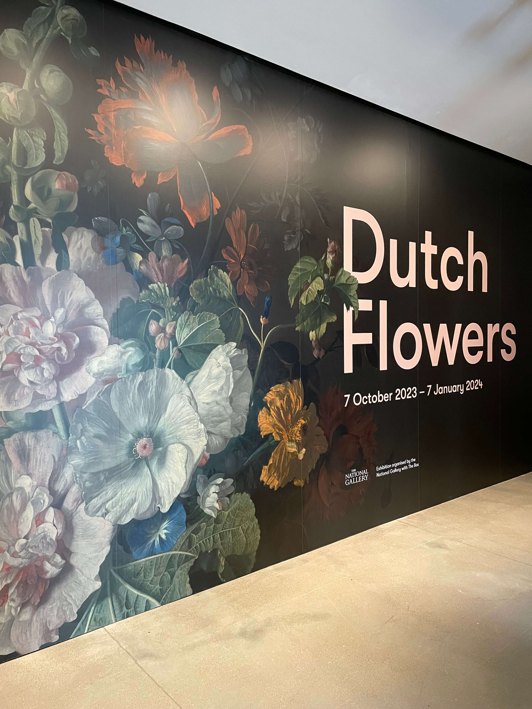
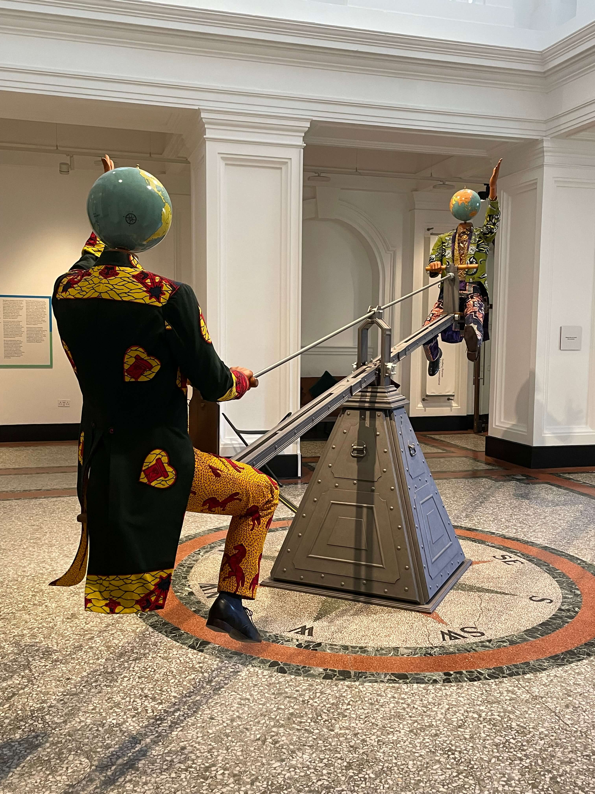

## Weeknote 1

### Work Stuff

Back to work and it’s firebreak week. 

Wanted to continue with last years firebreak project which was porting over our frontend architecture from node.js to bun.js. 

Previously at Bun v1.0.3 there was promise in the speed benefits of building and upgrading dependencies, however I could not get the project served correctly.

This week using Bun v1.0.21 and spending almost a full working day combatting webpack complaints, the project finally served without the use of yarn. 

The disappointing outcome is that the speed is basically the same, and the previously quicker commands had become a little slower.  

It was the right thing to work on but I think that’s it for my Bun.js journey. 

For the next firebreak I plan to look at using auto-refreshing modules to make development a little nicer. 

### Projects

Over the Christmas break I had finally decided it was time to implement progress pics and give the stash index page a bit of a cleaner look. So happy with finally publishing this feature, I made a quick demo video and posted to Instragram. I had one lovely cross stitch artist I had previously worked with email to say she was experiencing a problem, I fixed and replied within 15 mins. Small panic but these things happen when you’re the only person using the platform. 

> You can’t reliably test your own software.

This gave me a little bump in analytics and has given me the little boost of inspiration to finally make the user profile page. Design inspo coming from <a href="https://themeforest.net/item/friendy-figma-social-network-mobile-ui-kit/29084711#" target="_blank">ThemeForest</a> 

### Enjoyed Reading/Found Interesting

Finished reading Bookshops and Bonedust, made a start on Threads of Fate.

<a href="https://slate.com/technology/2023/12/personal-data-storage-evernote-google-drive-icloud.html?utm_source=pocket-newtab-en-gb" target="_blank">Evernote abandoning their free tier</a>. 

<a href="https://maggieappleton.com/ambient-copresence" target="_blank">Ambient copresence</a>. 

<a href="https://blog.partykit.io/posts/cursor-party" target="_blank">Cursor Party</a>. 

### Everything Else

First raid night back was a disaster (2 failed attempts and 2 successful, compared with our usual 6/7 successful) and hardcore is slow going but finally got our second life. 

A couple of AppleFitness strength and yoga sessions, 1 Rockfit and 1 gym session. 

Attended a wonderful exhibition at the Box, Dutch Flowers. Also got to see the new installation of <a href="https://www.theboxplymouth.com/events/exhibitions/yinka-shonibare-end-of-empire" target="_blank">End of Empire</a>, the photos do not do it justice, I stood and watched it for a good 10 mins and had a lovely discussion with the volunteer who told me all about the history behind it.

